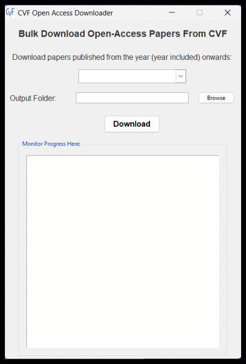

# CVF Open Access Downloader User Guide

## Introduction
The CVF Open Access Downloader is a Python application designed to bulk download open-access papers from CVF ([The Computer Vision Foundation](https://www.thecvf.com/)) conferences. This guide will walk you through the process of using the application to download papers to your local machine.

## System Requirements
- Operating System: Windows
- Internet connection

## Usage
1. Download the application files from the provided source.
2. Extract the contents of the downloaded ZIP file to a folder on your computer.
3. Launch the application by double-clicking the executable file.
4. The application window will appear with options to specify the year range and output folder.
5. Select the year range from the dropdown menu. By default, the range starts from 2013 to the current year.
6. Click the "Browse" button to choose the output folder where the downloaded papers will be saved.
7. Once the year range and output folder are selected, click the "Download" button to start the downloading process.
8. The progress of the downloads will be displayed in the "Monitor Progress Here" section of the application window.
9. After the download is complete, the application will indicate the completion status, and you can find the downloaded papers in the specified output folder.

## Notes
- The application utilizes multithreading to download multiple papers simultaneously, improving efficiency.
- Ensure a stable internet connection during the downloading process to prevent interruptions.
- You can close the application at any time by clicking the close button on the window.

## Troubleshooting
- If you encounter any errors during the downloading process, check your internet connection and ensure that the specified output folder is accessible and has sufficient storage space.
- For further assistance, you can contact the developer or refer to the provided documentation.

## About
- Developed by: Mohammad Naim Elham
- Version 1.0 (May 2024)
- To report bugs or send your feedback, contact the deveoper at solutionsstudioinbox@gmail.com
- You may contact developer to help you build your own apps
## Get the product here:
- [CVF Scrapper](https://naimelham.gumroad.com/l/cvfscrapper)
- Demo is included in this repository (can only download up to 50 papers)
- Youtube video: 
